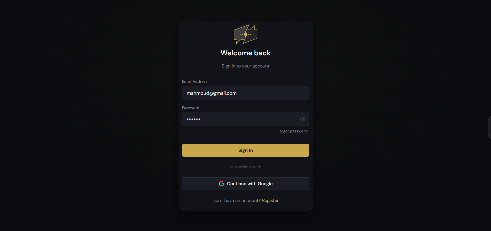
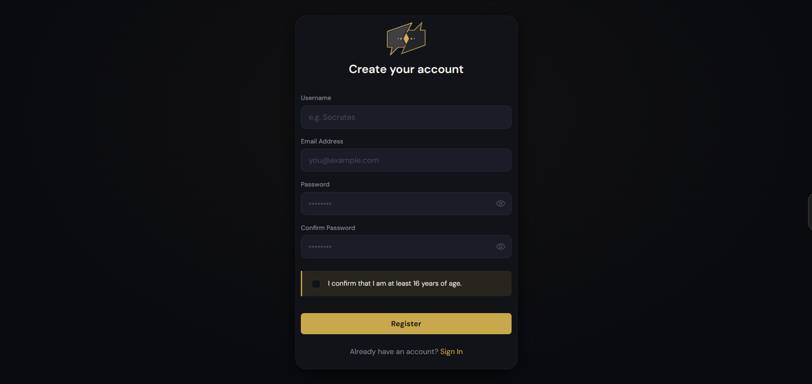
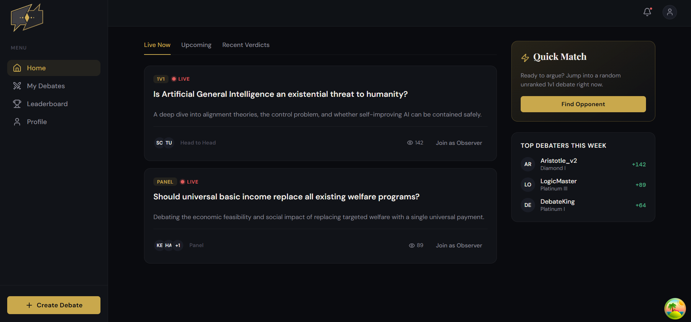
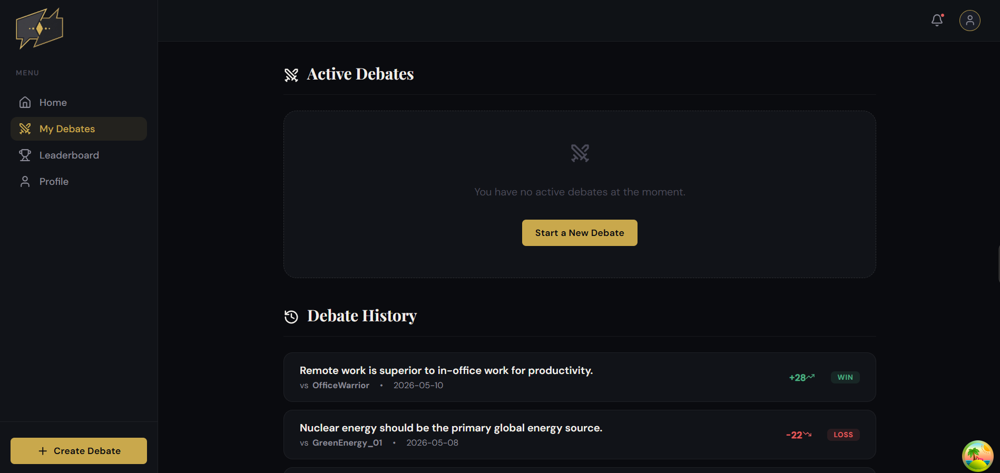
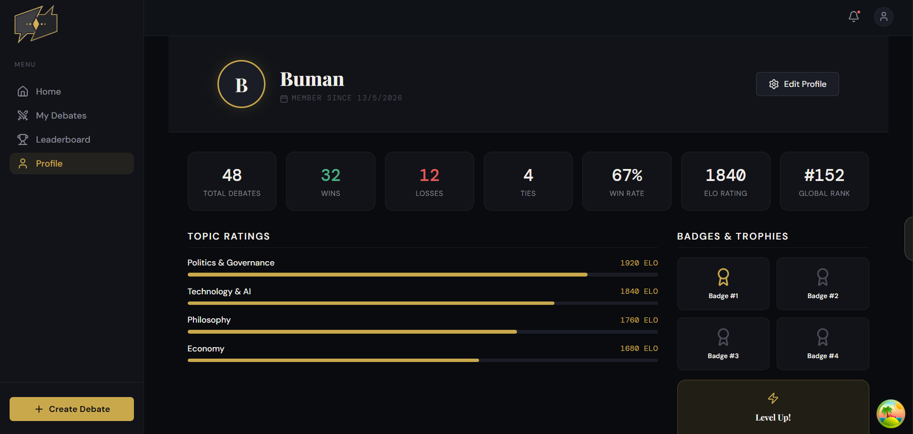

<div align="center">

# ⚔️ DebateArena

**AI-judged, real-time debate platform.**

[](https://react.dev)
[](https://www.typescriptlang.org)
[](https://nodejs.org)
[](https://prisma.io)
[](https://socket.io)
[](https://anthropic.com)

</div>

---

## What It Does

Two users debate a topic across **5 sub-questions**. Claude AI fact-checks in real time, then delivers a full scored verdict after both sides submit written summaries.

**Flow:** Create Session → Lobby → 30-min Discussion → 5-min Writing Phase → AI Verdict → ELO Update

---

## Screenshots

**Login**


**Sign Up**


**Home**


**My Debates**


**Profile**


---

## AI Roles

| Role | Trigger | Output |
|---|---|---|
| **Moderator** | Session creation | Flags banned/policy-violating topics |
| **Fact-Checker** | During debate (max 3/user) | `supported / disputed / unverifiable` + sources |
| **Judge** | After both submit | Scores 1–10 per criterion × 2 users → winner + summary |

**Verdict Criteria:** Clarity · Logic · Evidence · Responsiveness · Consistency

---

## Database (20 Tables)

`users` · `categories` · `sessions` · `session_participants` · `session_observers` · `debate_rounds` · `messages` · `fact_checks` · `research_queries` · `verdicts` · `verdict_scores` · `observer_votes` · `challenges` · `notifications` · `reports` · `blocks` · `badges` · `user_badges` · `user_topic_ratings` · `consent_logs`

---

## Background Workers (BullMQ)

| Worker | Trigger | Job |
|---|---|---|
| `verdictWorker` | Debate ends | Calls Claude → writes verdict → emits `verdict:ready` → queues ELO |
| `eloWorker` | After verdict | Recalculates global + topic ELO, updates W/L/T, checks badges |
| `expiryWorker` | 2h delay on session create | Expires unjoined sessions, notifies creator |

---

## Setup

```bash
# Backend
cd debatearena-server
npm install
cp .env.example .env
npx prisma migrate dev
npx prisma db seed
npm run dev                 # http://localhost:3000

# Frontend
cd debatearena-client
npm install
cp .env.example .env.local
npm run dev                 # http://localhost:5173
```

---

## Required Environment Variables

```env
# Backend
DATABASE_URL=mysql://root:@localhost:3306/debatearena
REDIS_URL=redis://localhost:6379
JWT_ACCESS_SECRET=
JWT_REFRESH_SECRET=
ANTHROPIC_API_KEY=
GOOGLE_CLIENT_ID=
GOOGLE_CLIENT_SECRET=
CLOUDINARY_CLOUD_NAME=
CLOUDINARY_API_KEY=
CLOUDINARY_API_SECRET=
RESEND_API_KEY=
ONESIGNAL_APP_ID=
ONESIGNAL_REST_API_KEY=
CLIENT_URL=http://localhost:5173

# Frontend
VITE_API_URL=http://localhost:3000/api
VITE_SOCKET_URL=http://localhost:3000
```
